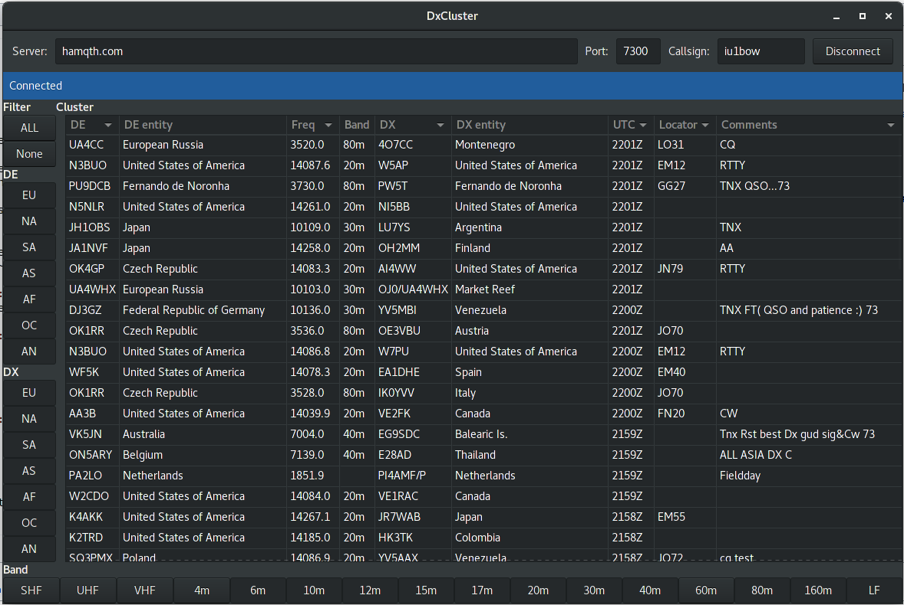

GDX 
===

### Ham radio cluster viewer

**Author:** Corrado Gerbaldo - IU1BOW.  
**Mail:** <corrado.gerbaldo@gmail.com>  
**Version:** Alpha    
**Last update:** 03/09/2017    
**Licensing:** Gpl V3.0 see ["LICENSE"](LICENSE) file.   
**OS:** GDX is written for GNU/Linux in C, with GTK 3.

This application connects to a dx cluster telnet server and shows all spots received from the remote server.  
You could apply continents and bands filters.
When you choose a filter, it is applied only on the list showed, but meanhile GDX continue to receive all spots from the remote server, so when you'll remove the filter you could show all spots received.

Screenshot
----------

Compile
-------

With the terminal move in the root directory (of this project) and launch the command "*make clean*", then after launch the command "*make*".

    % make clean   
    % make

You will find the "**gdx**" binary in the "*/bin*" directory.

**GTK 3**

If you are trying to compile a gtk-3 application and if you don’t have development package installed here is the error you can get:

    configure: error: Package requirements (gtk+-3.0 >= 3.0.0) were not met:

    No package ‘gtk+-3.0’ found

    Consider adjusting the PKG_CONFIG_PATH environment variable if you
    installed software in a non-standard prefix.

    Alternatively, you may set the environment variables GTK_CFLAGS
    and GTK_LIBS to avoid the need to call pkg-config.
    See the pkg-config man page for more details.

If you encounter this error in **Fedora,Redhat,CentOS**, you should install gtk3-devel. In terminal, type in the following:

    % su -c 'yum install gtk3-devel'

If you encounter this in **Ubuntu**, you should install libgtk-3-dev. To do so, type in the following in terminal:

    % sudo apt-get install libgtk-3-dev

Run
----------
After compiled, with the terminal move in to the "*bin*" directory and launch *./gdx*   

    % cd bin
    % ./gdx

Components
----------
*Application ("/src" directory):*
- **main.c**   : contains the main application and GUI implementation.
- **labels.h** : contains all the fixed (constant) labels used in the application.
- **telnet.h** : contains the connection and dialog with the dx cluster telnet remote server.
- **utility.h**: contains the utility rutines that can be used in this and in other applications.

*GUI ("/glade" directory):*
- **dxclusert.glade** : XML containig the information for GLADE in order to construct the GUI.
- **cluster.png**: application icon.
- **screenshot.png**: a screenshot of the application.

*Configuration ("/cfg" directory):*
- **band.cfg**   : contains the main application and GUI implementation
- **continents.cfg** : contains all the fixed (constant) labels used in the application
- **country.cfg** : contains the connection and dialog with the dx cluster telnet remote server.
- **utility.h**: contains the utility rutines that can be used in this and in other applications.

*Binary ("/bin" directory):*
- **gdx**   : the binary executable.

*Various ("/" directory):*
- **LICENSE**: lincense file (Gpl 3.0).
- **makefile**: compile instructions.
- **README.md**: this file.

TODO List / Roadmap
---------

**Beta version**
- port all global variables in glb
- about dialog
- trim input fields
- time out and kill process
- get connection error (and reset the connection button)
- mange a preference file
- utc with ":""
- check pango-layout utf8 warning

**V0.1**
- run without terminal --> put a pseudo-terminal on gui
- change the prefix managing basing on:
  -  https://www.country-files.com/cty-dat-format/
  -  https://www.country-files.com/contest/n1mm/
- code refactoring.
- configuration / preference file
